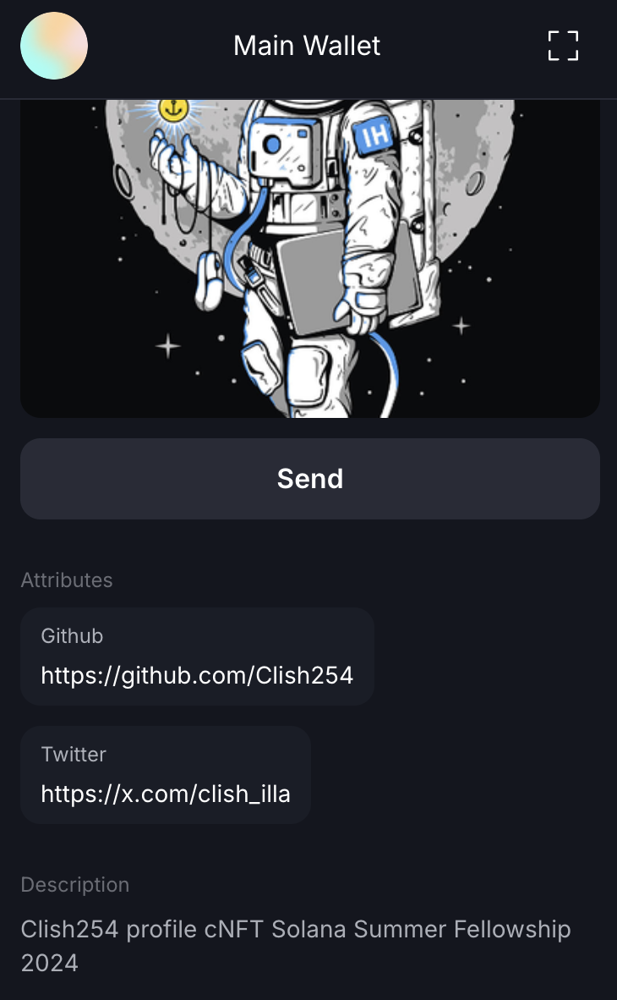

# Compressed NFTs - cNFTs
Assignmet for module 8 of Solana Summer Internship 2024
```
Create a cNFT collection of your own profile picture and social links as metadata and airdrop it to other fellows.
```

This script will airdrop all wallet addresses in the fellow-keys.json a cNFT of my profile picture and my social links will be attributes in the nft metadata.

[pinata](https://app.pinata.cloud/) is used for metadata upload to ipfs.

You can confirm the airdrop was done by checking signatures for each fellow's transaction in the cnft-mint-signatures.md file.

The airdrop was done on devnet.

## Solflare sneakpeak


## Steps to run the project
1. Add environment variables
```sh
RPC_URL=
PINATA_JWT=
```
2. Install yarn if you don't have it already
```sh
npm install -g yarn
```
3. Install dependencies
```sh
yarn install
```
4. Run the script
```sh
yarn start
```
